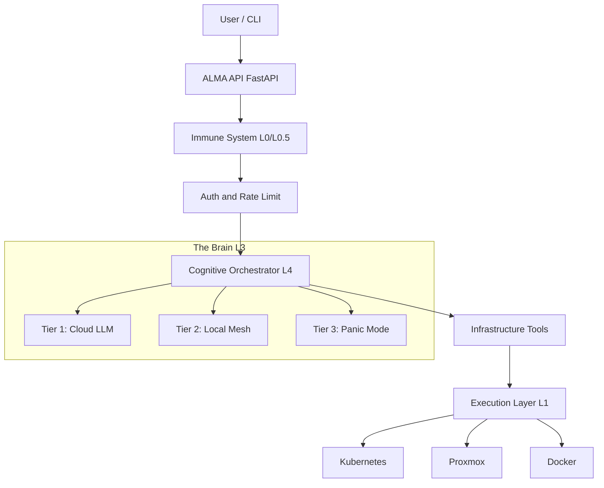

# ALMA: Infrastructure as Conversation

[](https://www.python.org/downloads/)
[](https://pypi.org/project/alma/)
[]()
[](LICENSE)
[](SECURITY.md)

**Stop writing YAML. Start conversing.**
ALMA is the first **Cognitive & Resilient Infrastructure Platform**.
It doesn't just execute commands; it protects resources, understands context, works offline, and adapts its persona to your emotional state.

## 🛡️ Resiliency Policy: The Core Philosophy
ALMA is built on the **Non-Violence** principle.
1.  **Silent Defense**: It doesn't fight attacks; it renders them irrelevant via Information Theory (Entropy & Compression filters).
2.  **Resource Respect**: It never wastes energy (LLM tokens) if a lighter solution (Regex/Local Model) suffices.
3.  **Local Sovereignty**: It refuses to die when the Cloud disconnects.

## Key Features

## Why ALMA?

1.  **Production-Ready Security**: Standard WAF patterns (SQL injection, XSS, path traversal) with input size limits and rate limiting.
2.  **Type-Safe Architecture**: Pydantic models throughout, proper exception handling, and strict validation.
3.  **Real Cloud Integration**: Actual pricing APIs (Infracost, AWS) instead of hardcoded estimates.

### Zero-Energy Defense

Input validation before it reaches the core:

- **L0 (Regex Guard)**: Blocks known malicious patterns (SQL injection, XSS, path traversal, code injection).
- **L2 (Size Limits)**: 2KB query parameters, 1MB request body.
- **L3 (Rate Limiting)**: Redis-backed rate limiting per IP/API key.

### Developer-Friendly Error Handling

ALMA provides clear error messages with proper debugging support:
- **Medic Persona**: Intercepts system crashes and translates technical errors into calm, diagnostic dialogue.
- **Risk Guard**: Detects user frustration and blocks destructive commands (e.g., "DELETE DB") until emotional stability returns.

### TUI Dashboard
Real-time terminal UI (`ALMA monitor`) featuring:
- **Live Neural Status**: Watch the switch between Cloud and Local brain.
- **Immune Activity**: See blocked threats in real-time.
- **System Health**: Latency, tokens/sec, and resource usage.

## Architecture



## Quick Start

### Prerequisites
- Python 3.10+
- Docker (for metrics stack)
- LM Studio (optional, for local fallback)

### Installation

1.  **Install via PyPI**:
    ```bash
    pip install alma
    ```

2.  **Initialize the Brain**:
    ```bash
    # Start the API Server
    alma start-server
    ```

3.  **Launch the Dashboard**:
    ```bash
    # In a new terminal
    alma monitor
    ```

## Documentation

- **[User Guide](docs/USER_GUIDE.md)**: Complete manual for daily usage.
- **[API Reference](docs/API_REFERENCE.md)**: Detailed endpoint documentation.
- **[Security Policy](SECURITY.md)**: Vulnerability reporting and security features.
- **[Contributing](CONTRIBUTING.md)**: Setup guide for developers.

## Contributing

We welcome contributions! Please see [CONTRIBUTING.md](CONTRIBUTING.md) for details on how to set up your development environment and submit Pull Requests.

## License

This project is licensed under the MIT License - see the [LICENSE](LICENSE) file for details.