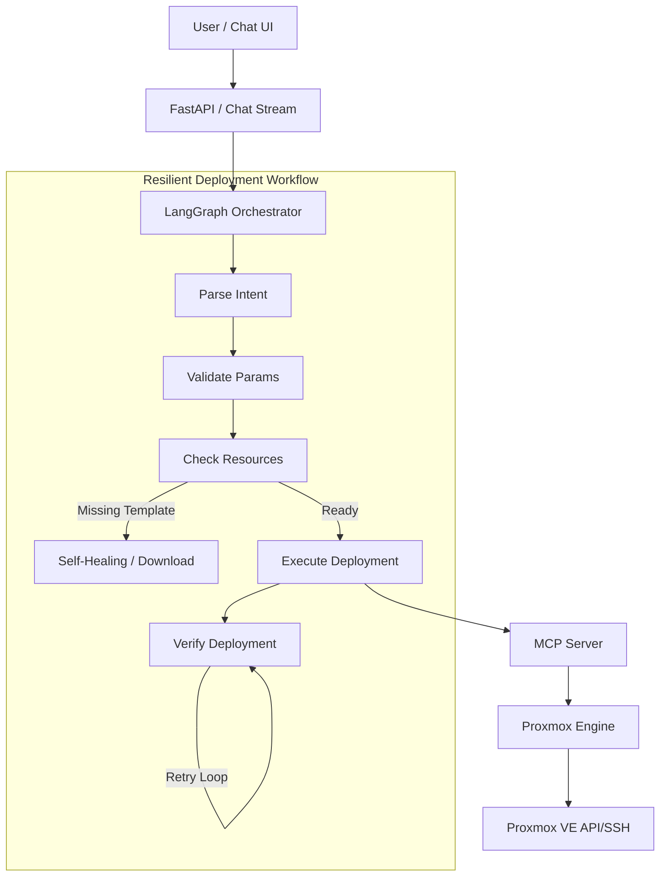

# ALMA: Infrastructure as Conversation

[](https://www.python.org/downloads/)
[](https://modelcontextprotocol.io)
[](https://langchain-ai.github.io/langgraph/)
[](https://www.docker.com/)
[](LICENSE)

**Stop writing YAML. Start conversing.**  
ALMA (Autonomous Language Model Architecture) is a resilient, self-healing infrastructure orchestration platform. It combines natural language interfaces with **LangGraph** state machines and the **Model Context Protocol (MCP)** to reliably deploy and manage resources on Proxmox and beyond.

## Core Capabilities

- **🗣️ Natural Language Interface**: Chat with your infrastructure ("Deploy an Alpine LXC named web-01").
- **🧠 Resilient State Machine**: deployments are managed by a **LangGraph** workflow that handles validation, execution, and verification with automatic retries.
- **🛡️ Self-Healing**: Automatically detects missing dependencies (e.g., templates) and resolves them (downloads) without user intervention.
- **🔌 MCP Native**: Exposes infrastructure tools via a standard **Model Context Protocol** server, making it compatible with Anthropic Claude, Google Gemini, and other LLMs.
- **⚡ Proxmox Integration**: Advanced engine with task-aware waiting, SSH/API dual-mode, and robust LXC/VM management.

## Architecture

ALMA uses a layered architecture designed for resilience:



## Quick Start

### Prerequisites
- Docker & Docker Compose
- Proxmox VE (Credentials)
- OpenAI/Anthropic/Google API Key (for LLM features)

### Installation

1.  **Clone the Repository**:
    ```bash
    git clone https://github.com/fabriziosalmi/alma.git
    cd alma
    ```

2.  **Configure Environment**:
    ```bash
    cp .env.example .env
    # Edit .env with your Proxmox and LLM credentials
    ```

3.  **Launch with Docker Compose**:
    ```bash
    docker compose up -d --build
    ```

4.  **Access the Dashboard**:
    Open [http://localhost:3000](http://localhost:3000) to start chatting with your infrastructure.

## Documentation

- **[User Guide](docs/USER_GUIDE.md)**: Complete manual for daily usage.
- **[Architecture](docs/ARCHITECTURE.md)**: Deep dive into LangGraph and MCP implementation.
- **[Contributing](CONTRIBUTING.md)**: Development setup.

## Community & Support
- [GitHub Discussions](https://github.com/fabriziosalmi/alma/discussions)
- [Issue Tracker](https://github.com/fabriziosalmi/alma/issues)

## License
This project is licensed under the MIT License - see the [LICENSE](LICENSE) file for details.