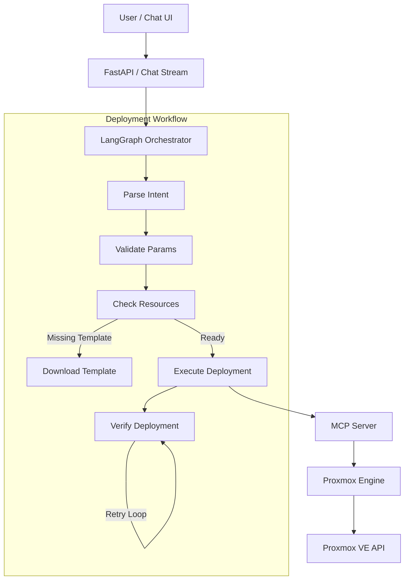

# ALMA: Infrastructure as Conversation

[](https://www.python.org/downloads/)
[](https://modelcontextprotocol.io)
[](https://langchain-ai.github.io/langgraph/)
[](https://www.docker.com/)
[](LICENSE)

ALMA (Autonomous Language Model Architecture) is an infrastructure orchestration platform that combines a natural language chat interface with **LangGraph** state machines and the **Model Context Protocol (MCP)** to deploy and manage resources on Proxmox and other providers.

```bash
alma deploy blueprint.yaml
alma templates list
alma dashboard
alma council convene "web app with database"
```

## Core Features

- **Natural Language Interface**: Chat with your infrastructure ("Deploy an Alpine LXC named web-01") via the REST API or CLI.
- **LangGraph Workflow**: Deployments run through a state machine that handles intent parsing, parameter validation, resource checks, execution, and verification with retries.
- **Self-Healing**: Detects missing templates and attempts to download them automatically before deployment (Proxmox engine).
- **Circuit Breakers**: Built-in `CircuitBreaker` and `Retrier` patterns in `alma/core/resilience.py` improve stability under failure.
- **MCP Server**: Exposes Proxmox tools (list, deploy, control, download template) via the Model Context Protocol, compatible with MCP clients such as Claude Desktop.
- **Proxmox Engine**: Primary supported engine with API-based LXC/VM creation, cloning, and task tracking.
- **WebSocket & GraphQL**: WebSocket endpoint for real-time deployment events; basic GraphQL endpoint for system status queries.
- **The Council**: Multi-agent system (Architect, SecOps, FinOps) that collaborates via LLM calls to design and critique infrastructure blueprints before deployment.
- **Kubernetes Engine**: Experimental engine for Deployments and Services (requires a reachable cluster).

## Architecture

ALMA uses a layered architecture:



## Quick Start

### Prerequisites
- Docker & Docker Compose
- Proxmox VE credentials (for Proxmox engine)
- An OpenAI-compatible LLM endpoint (local or cloud) for AI features

### Installation

1.  **Clone the Repository**:
    ```bash
    git clone https://github.com/fabriziosalmi/alma.git
    cd alma
    ```

2.  **Configure Environment**:
    ```bash
    cp .env.example .env
    # Edit .env with your Proxmox and LLM credentials
    ```

3.  **Launch with Docker Compose**:
    ```bash
    docker compose up -d --build
    ```

4.  **Access the API**:
    Open [http://localhost:8000/docs](http://localhost:8000/docs) for the interactive API documentation.

## Documentation

- **[User Guide](docs/USER_GUIDE.md)**: Complete manual for daily usage.
- **[Architecture](docs/ARCHITECTURE.md)**: Deep dive into LangGraph and MCP implementation.
- **[Contributing](CONTRIBUTING.md)**: Development setup.

## Community & Support
- [GitHub Discussions](https://github.com/fabriziosalmi/alma/discussions)
- [Issue Tracker](https://github.com/fabriziosalmi/alma/issues)

## License
This project is licensed under the MIT License - see the [LICENSE](LICENSE) file for details.